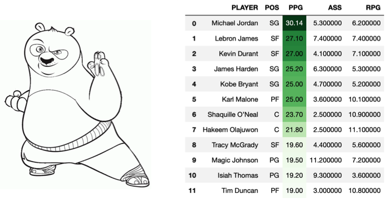

<FONT SIZE="6"><B>WORKING WITH DATAFRAMES</B><FONT>



This is a simple repository where I am summarizing some of what I have found to be the most useful Pandas functionalities while working with Dataframes. The current content is listed below and because I am using it as support material for my work, I will be updating it as I keep on progressing. There will be some basic visualizations every now and then, however, I won't go to deep into them as I intend to write separate repositories for using Matplotlib, SeaBorn and Plotly.

<b><u>CONTENT</u>:</b>

* Creating Dataframes<br>
* Renaming Columns<br>
* Reversing All Rows<br>
* Reversing All Columns<br>
* Merging Dataframes<br>
* Appending Dataframes<br>
* Highlighting Min and Max Column Values<br>
* Adding a Column from a List<br>
* Re-organizing Columns<br>
* Sorting Dataframes by Column Values<br>
* Column and Row Slicing<br>
* Adding Row(s)<br>
* Profiling Dataframes<br>
* Dropping Column(s) & Row(s)<br>
* Generating Descriptive Statistics<br>
* Basic Visualization With Plotly

<b>Last update:</b> 09/10/2020


```python

```
